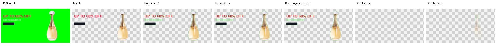
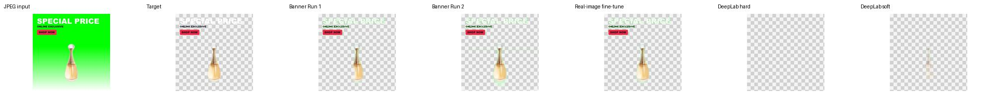
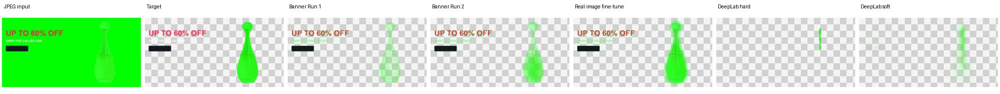
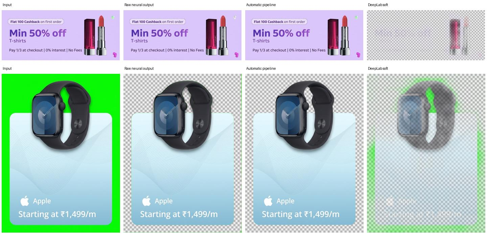

# Green-background removal: current model vs supplied DeepLab V3

25 September 2026 · Frozen, paired tests · 144 held-out offer banners + 144 synthetic stress images · 18 held-out product assets.

## Findings

The current neural model achieves 96.36% foreground IoU versus 15.16% for DeepLab’s soft-mask conversion on held-out banners. Its alpha error is 0.00657 versus 0.10370, a reduction of 93.7%. DeepLab is smaller and roughly 15.1× faster at similar input size with four CPU threads.

These tables compare raw TFLite model outputs. The application additionally preserves non-chroma images intact and uses local color projection for uniform green backgrounds. Those application rules are not credited to neural-model accuracy. DeepLab has semantic class outputs rather than a transparency channel; both hard and soft foreground conversions are evaluated.

## Held-out offer banners

| Method | Accuracy | Precision | Recall | F1 | IoU | Alpha MAE ↓ |
|---|---|---|---|---|---|---|
| Banner Run 1 | 99.61% | 98.18% | 98.61% | 98.39% | 96.83% | 0.00716 |
| Banner Run 2 | 99.60% | 97.88% | 98.83% | 98.35% | 96.75% | 0.00862 |
| Real-image fine-tune (current) | 99.55% | 97.51% | 98.80% | 98.15% | 96.36% | 0.00657 |
| DeepLab hard | 89.03% | 86.49% | 10.83% | 19.24% | 10.65% | 0.11369 |
| DeepLab soft | 89.58% | 89.51% | 15.43% | 26.32% | 15.16% | 0.10370 |

## Held-out synthetic edge cases

| Method | Accuracy | Precision | Recall | F1 | IoU | Alpha MAE ↓ |
|---|---|---|---|---|---|---|
| Banner Run 1 | 98.23% | 94.48% | 88.98% | 91.65% | 84.58% | 0.03099 |
| Banner Run 2 | 98.18% | 90.58% | 92.98% | 91.76% | 84.78% | 0.02513 |
| Real-image fine-tune (current) | 98.99% | 94.50% | 96.36% | 95.42% | 91.25% | 0.01505 |
| DeepLab hard | 89.87% | 85.95% | 8.43% | 15.35% | 8.31% | 0.10772 |
| DeepLab soft | 90.16% | 87.19% | 11.40% | 20.16% | 11.21% | 0.10344 |

Binary foreground uses alpha ≥0.5. Confusion metrics aggregate pixel counts; alpha errors average per-image errors on a 0–1 scale. Large background areas inflate pixel accuracy, so foreground recall, IoU and alpha error are more informative than accuracy alone.

## Offer text and soft boundaries

| Method | Suite | Text-core recall ↑ | Text alpha MAE ↓ | Soft-edge MAE ↓ |
|---|---|---|---|---|
| Banner Run 1 | banners | 97.13% | 0.05268 | 0.05499 |
| Banner Run 1 | edge_cases | 97.38% | 0.06185 | 0.08424 |
| Banner Run 2 | banners | 97.21% | 0.05406 | 0.05724 |
| Banner Run 2 | edge_cases | 97.47% | 0.06096 | 0.07938 |
| Real-image fine-tune (current) | banners | 97.15% | 0.05555 | 0.05931 |
| Real-image fine-tune (current) | edge_cases | 97.50% | 0.06214 | 0.07450 |
| DeepLab hard | banners | 1.13% | 0.58458 | 0.36868 |
| DeepLab hard | edge_cases | 0.06% | 0.58266 | 0.36356 |
| DeepLab soft | banners | 1.13% | 0.56696 | 0.33580 |
| DeepLab soft | edge_cases | 0.11% | 0.55706 | 0.32884 |

Text-core recall measures opaque glyph pixels retained as foreground. It is not OCR accuracy or a guarantee of legibility. Soft-edge error covers target alpha from 0.02 to 0.98. DeepLab removes most offer lettering under the tested class-to-foreground mapping.

## Background and stress breakdown

| Case | Banner Run 1 MAE ↓ | Banner Run 2 MAE ↓ | Real-image fine-tune (current) MAE ↓ | DeepLab hard MAE ↓ | DeepLab soft MAE ↓ |
|---|---|---|---|---|---|
| floor_gradient | 0.01007 | 0.01220 | 0.00846 | 0.12085 | 0.11842 |
| green_foreground | 0.07139 | 0.04809 | 0.03027 | 0.11917 | 0.12388 |
| green_shade | 0.01474 | 0.02543 | 0.00894 | 0.11550 | 0.09924 |
| green_spill | 0.00736 | 0.00748 | 0.00769 | 0.10877 | 0.10117 |
| heavy_jpeg | 0.00638 | 0.00613 | 0.00689 | 0.10935 | 0.10313 |
| off_green | 0.12938 | 0.10491 | 0.04095 | 0.10850 | 0.10484 |
| pale_floor | 0.00953 | 0.01155 | 0.00807 | 0.10110 | 0.09685 |
| soft_shadow | 0.00704 | 0.00729 | 0.00772 | 0.12366 | 0.11504 |
| solid_green | 0.00541 | 0.00522 | 0.00586 | 0.11219 | 0.10199 |
| tiny_text_lines | 0.00826 | 0.00806 | 0.00938 | 0.11637 | 0.11226 |
| translucency | 0.00861 | 0.00757 | 0.00939 | 0.07484 | 0.07036 |

## Size and speed

| Model | File size | Input | Output | Median / p95 CPU inference |
|---|---|---|---|---|
| Banner Run 1 | 4.043 MB | 256×256 RGB | 1 alpha channel | 108.54 / 111.46 ms |
| Banner Run 2 | 4.043 MB | 256×256 RGB | 1 alpha channel | 108.22 / 111.23 ms |
| Real-image fine-tune (current) | 4.043 MB | 256×256 RGB | 1 alpha channel | 108.68 / 111.56 ms |
| DeepLab soft | 2.779 MB | 257×257 RGB | 21 class scores | 7.19 / 7.71 ms |

Four CPU threads per interpreter, three warm-ups. Set input + invoke + get output only; excludes preprocessing, resizing, softmax, file I/O and browser runtime. Models are measured sequentially on the same inputs.

Runtime: TensorFlow 2.16.2 on macOS-26.5.1-arm64-arm-64bit. Sizes exclude browser runtime downloads. No cloud inference or paid image generation was used for this comparison.

## Native-resolution diagnostic subset

18 unique held-out product assets, one banner per product, six per background. Diagnostic subset only; not additional independent test sources. Native labels retained. Banner uses native-resolution halo-protected tiles with two CPU threads; DeepLab uses one global 257px prediction with two CPU threads and mask upsampling. Different work makes these deployment-path timings, not equal-work model benchmarks. Both timings include their array preprocessing but exclude image-file loading.

| Method | Accuracy | Precision | Recall | IoU | Alpha MAE ↓ | Median processing |
|---|---|---|---|---|---|---|
| Real-image fine-tune (current) | 99.65% | 97.96% | 99.14% | 97.14% | 0.00707 | 3249.2 ms |
| DeepLab hard | 87.96% | 48.88% | 9.37% | 8.53% | 0.12449 | 20.9 ms |
| DeepLab soft | 88.41% | 57.07% | 13.14% | 11.96% | 0.11914 | 20.5 ms |

| Background | Real-image fine-tune (current) MAE ↓ | DeepLab hard MAE ↓ | DeepLab soft MAE ↓ |
|---|---|---|---|
| solid_green | 0.00462 | 0.11652 | 0.11523 |
| green_shade | 0.00753 | 0.12660 | 0.10759 |
| floor_gradient | 0.00906 | 0.13035 | 0.13460 |

These are 18 reused held-out sources, not 18 additional independent products. Native tiled inference does much more work than one global DeepLab mask. Use the fixed-size table for the cleaner model-speed comparison.

## Visual comparison on held-out images

Columns are input, target, Run 1, Run 2, real-image fine-tune, DeepLab hard and DeepLab soft. Predictions use the same observed JPEG colors with each alpha mask, without despill, to isolate masking. Targets use original foreground colors. Examples are the first test item per case, not handpicked by results.

Solid green and offer text

Floor gradient

Green foreground stress

## User-supplied banners: training and acceptance cases

The makeup image is a lavender banner, not a green-backdrop input. The user explicitly requested that it remain intact, including both decorative cubes. The application preserves all decoded RGB pixels and full opacity. The watch should retain its blue card, logo, offer text and watch while removing the exterior green and green opening in the strap.

Training added 64 exact all-opaque makeup crops and 128 weak watch crops. Watch targets are estimated from chroma colors, with confidence 0.15 away from uncertain edges; they are not independent ground truth. The follow-up used one epoch at learning rate 0.00002. These originals are excluded from held-out accuracy scores, and improved test scores cannot be attributed to the real images alone because the run also repeats existing banner/edge training.

Real examples: input, raw neural mask, application output, DeepLab soft. These images were used for training; visual acceptance only.

Acceptance checks: makeup RGB is pixel-identical to the decoded input and every alpha value is 255. On the watch, sampled background and strap opening have alpha 0, sampled card and watch face have alpha 255, and positive green excess is zero in the tested three-pixel visible boundary band. Python and browser implementations pass these checks. This does not prove perfect human-perceived boundaries everywhere.

## Protocol, assumptions and uncertainty

Same aspect-preserving resize to fit 256 and bottom/right edge padding as earlier banner tests. DeepLab padded canvas rescaled to 257; output masks bilinear-rescaled to 256; padding excluded. Input normalized per validation selection.

Training/validation/test product hashes remain disjoint. Both main test suites share 18 source products; 288 variants are not 288 independent products. Compositing alpha is exact, but source product cutouts were not manually corrected. Neither test suite uses weak Gemini masks or the newly supplied originals as ground truth.

The supplied file has float32 input [1,257,257,3] and float32 output [1,257,257,21]. No class-label or preprocessing documentation accompanied it. Channel 0 is assumed background. Hard decoding takes argmax !=0; soft decoding uses 1−softmax(background). Semantic probability is not physical opacity. This is a comparison of the provided artifact under these disclosed assumptions, not all DeepLab variants.

Input normalization was selected independently for hard and soft decoding by validation foreground IoU on 72 validation banners plus 72 validation stress images. Both selected [-1,1]. Threshold stays 0.5. No test-based tuning was performed.

| Normalization | Decoder | Validation IoU | Validation MAE ↓ |
|---|---|---|---|
| minus_one_one | hard | 21.77% | 0.09316 |
| minus_one_one | soft | 24.97% | 0.09228 |
| zero_one | hard | 14.10% | 0.10878 |
| zero_one | soft | 16.87% | 0.11453 |
| raw | hard | 0.60% | 0.10855 |
| raw | soft | 0.62% | 0.12952 |

| Paired comparison | Mean alpha-error advantage | 95% product-cluster interval |
|---|---|---|
| banners:deeplab_hard_minus_banner_real | 0.10712 | [0.08642, 0.12893] |
| banners:deeplab_soft_minus_banner_real | 0.09713 | [0.08162, 0.11365] |
| edge_cases:deeplab_hard_minus_banner_real | 0.09267 | [0.07541, 0.11130] |
| edge_cases:deeplab_soft_minus_banner_real | 0.08839 | [0.07378, 0.10395] |

Positive differences favor the current model. Intervals use 5,000 paired bootstrap resamples of 18 product clusters, preserving correlated variants. They do not estimate uncertainty over arbitrary future banners. Matching green foreground/background is inherently ambiguous; unseen gradients and fine translucency remain limitations. The conservative no-green guard can preserve a partially green image if too little key color touches its border.

## Reproduce and inspect

Run compare_deeplab_banners.py, then compare_deeplab_native.py with --deeplab /path/to/deeplabv3.tflite, then write_deeplab_report.py. Machine-readable evidence is in metrics.json, native_metrics.json and summary.csv. The original DeepLab file is evaluated in place and is not republished. Its SHA-256 is 68a539782c2c6a72f8aac3724600124a85ed977162b44e84cbae5db717c933c6.
